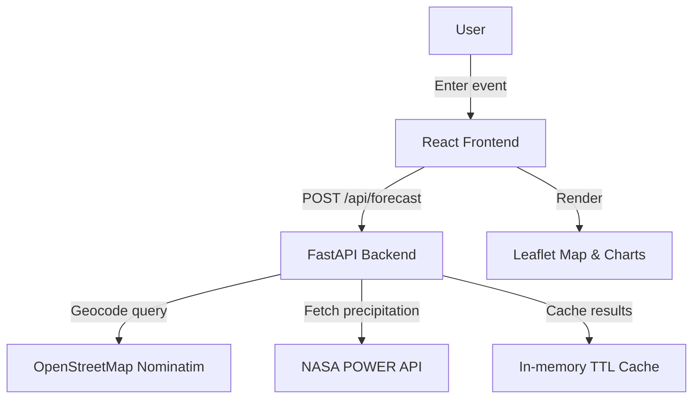

# System Architecture

- **Frontend**: Vite + React SPA served statically, using React Query for data fetching and Leaflet for mapping.
- **Backend**: FastAPI service that orchestrates geocoding, NASA POWER precipitation retrieval, and risk scoring.
- **Caching**: In-memory TTL cache to keep responses warm for 15 minutes.
- **Deployment**: Containerized with Docker; docker-compose spins up frontend + backend for local preview.
